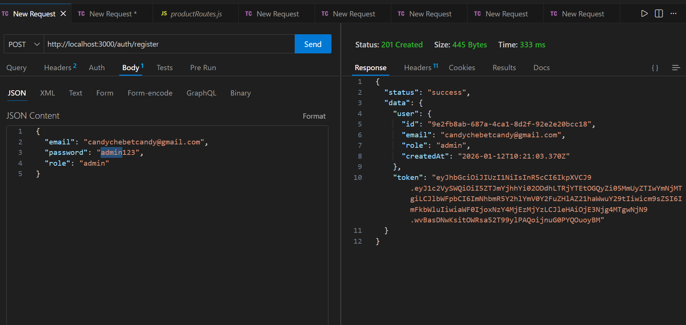
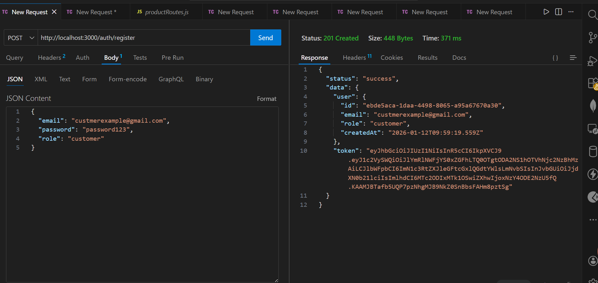
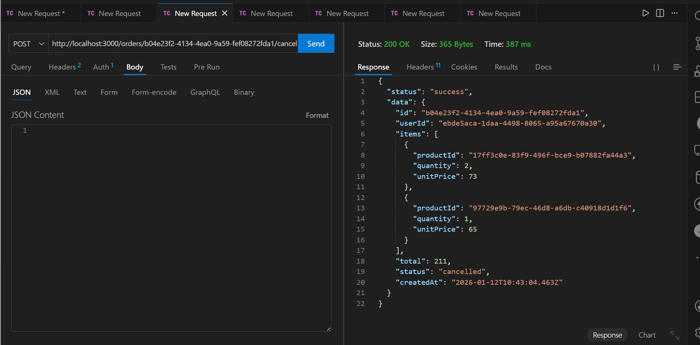
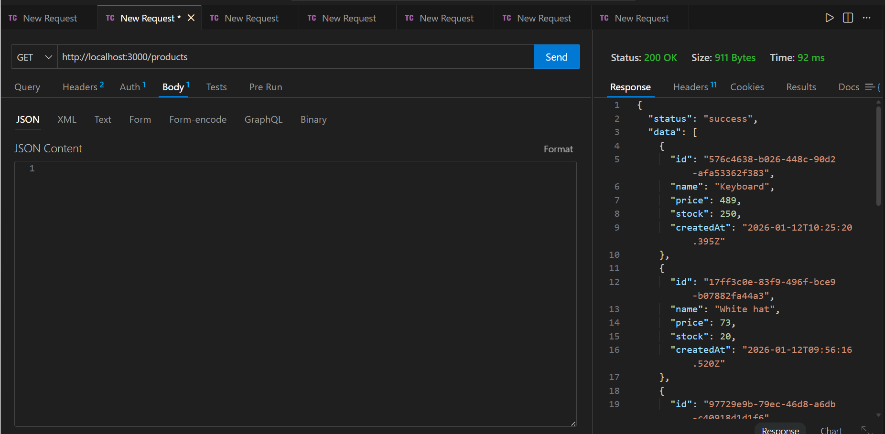
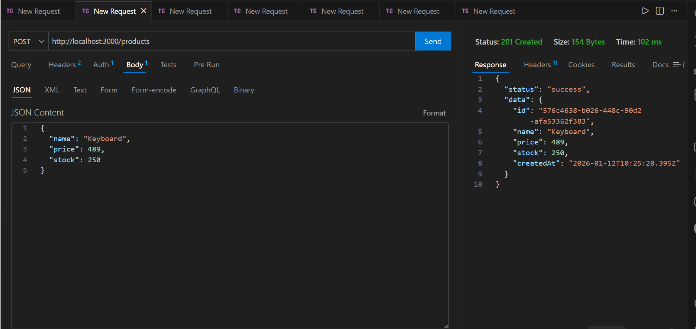
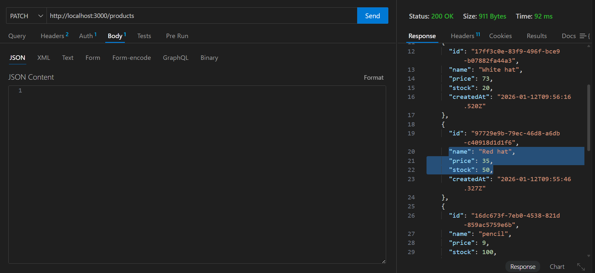
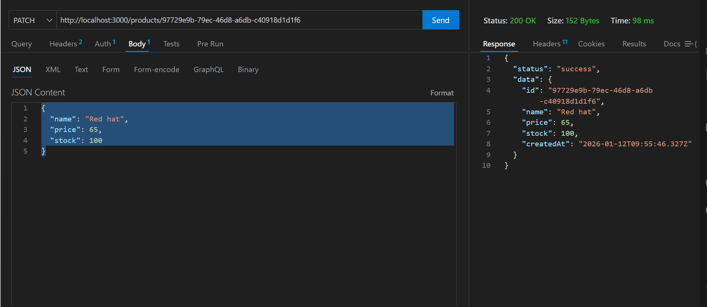
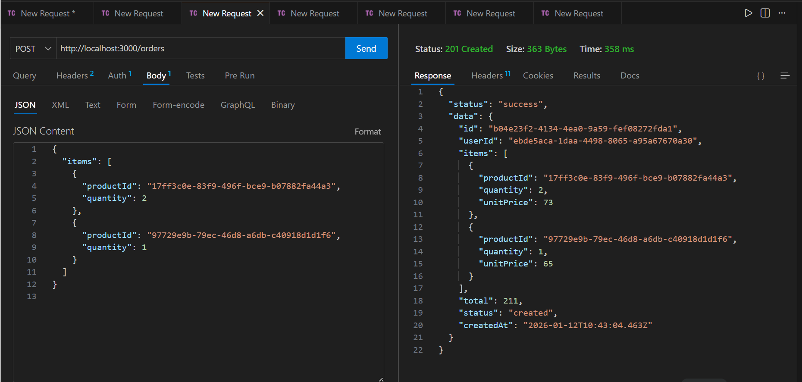
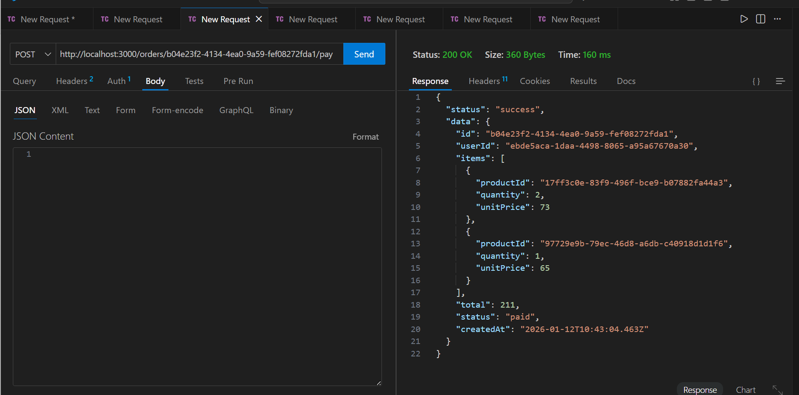

# Order Service API

## 🐳 Running with Docker

### Prerequisites
- Docker Desktop installed ([Download here](https://www.docker.com/products/docker-desktop))
- Docker Compose (included with Docker Desktop)

### Quick Start with Docker

1. **Start MongoDB with Docker**
```bash
   docker-compose up -d
```

2. **Verify MongoDB is running**
```bash
   docker ps
```
   
   You should see:
```
   CONTAINER ID   IMAGE       PORTS                      NAMES
   abc123...      mongo:7.0   0.0.0.0:27017->27017/tcp   order_service_db
```

3. **Install dependencies and seed database**
```bash
   npm install
   npm run seed
```

4. **Start the application**
```bash
   npm run dev
```

5. **Access the API**
```
   http://localhost:3000
```

**SWAGGER**
```
/api-docs
```

### Docker Commands Reference
```bash
# Start services
docker-compose up -d

# Stop services (keeps data)
docker-compose stop

# Stop and remove containers (keeps data in volumes)
docker-compose down

# Stop and remove everything including data
docker-compose down -v

# View logs
docker-compose logs -f

# Check service status
docker-compose ps

# Restart services
docker-compose restart
```

### Troubleshooting Docker

**Port already in use:**
```bash
# Stop existing MongoDB
docker stop order_service_db
# Or if running locally:
# macOS: brew services stop mongodb-community
# Windows: net stop MongoDB
```

**Container won't start:**
```bash
# Check logs
docker-compose logs mongodb

# Restart from scratch
docker-compose down -v
docker-compose up -d
```


## BASE URL for hosted version: 
```bash

https://mid-levelbackendengineertask.onrender.com

```
- may be a little slow because it's a free version

A production-ready RESTful API for managing orders, products, and users with authentication, built with Node.js, Express, and MongoDB.

## Features

- **Authentication**: JWT-based authentication with bcrypt password hashing
- **Role-based Access Control**: Admin and customer roles with different permissions
- **Transaction Safety**: MongoDB transactions for atomic stock updates
- **Comprehensive Validation**: Zod schemas for request validation
- **Error Handling**: Centralized error handling with custom error classes
- **Rate Limiting**: Protection against brute force attacks
- **Logging**: Structured logging with Winston
- **Testing**: Unit and integration tests with Jest
- **Clean Architecture**: Separation of concerns (routes → controllers → services → repositories)


---

## API Screenshots

## Health Check


### Authentication Flow

#### Register Admin


#### Register Customer


#### Login


#### Login with Hosted API


---

### Product Management

#### Get All Products


#### Create Product (Admin Only)


#### Update Product - Before


#### Update Product - After


---

### Order Management

#### Customer Create Order


#### Pay for Order


#### Cancel Order


---


## ⚠️ Important Note on Transactions

**Development Environment Limitation**: If you choose to go with non-docker or productions implementations, the local development implementation currently runs without MongoDB transactions due to using a standalone MongoDB instance. 


**Production Solution**: In a production environment, this code is **transaction-ready**:

## Prerequisites

- Node.js >= 18.x
- MongoDB >= 6.x
- npm or yarn

## Installation

### Local Development

1. **Clone the repository**
   ```bash
   git clone <repository-url>
   cd order-service
   ```

2. **Install dependencies**
   ```bash
   npm install
   ```

3. **Create environment file**
   ```bash
   cp .env.example .env
   ```

4. **Start MongoDB**
   ```bash
   # Using Homebrew on macOS
   brew services start mongodb-community

   # Or using mongod directly
   mongod --dbpath /path/to/data
   ```


## ⚙️ Configuration

Create a `.env` file in the root directory with the following variables:

### Environment Variables
```env
NODE_ENV=development
PORT=3000
MONGODB_URI=mongodb://localhost:27017/order_service
JWT_SECRET=your-super-secret-jwt-key-change-in-production-min-32-chars
JWT_EXPIRES_IN=7d
BCRYPT_ROUNDS=10
```

## Running the Application

### Development Mode

```bash
npm run dev
```

The server will start with auto-reload on file changes.

### Production Mode

```bash
npm start
```

### Health Check

```bash
curl http://localhost:3000/health
```

Expected response:
```json
{
  "status": "ok",
  "timestamp": "2024-01-11T10:30:00.000Z"
}
```

## Database Seeding

Seed the database with sample data:

```bash
npm run seed
```

This creates:
- **Admin user**: `admin@example.com` / `admin123`
- **Customer user**: `customer@example.com` / `customer123`
- **Sample products**: 5 products with various prices and stock levels

## API Documentation

### Base URL

```
http://localhost:3000
```

### Authentication

All protected routes require a JWT token in the Authorization header:

```
Authorization: Bearer <token>
```

---

### Authentication Endpoints

#### Register a New User

```bash
curl -X POST http://localhost:3000/auth/register \
  -H "Content-Type: application/json" \
  -d '{
    "email": "user@example.com",
    "password": "password123",
    "role": "customer"
  }'
```

**Response (201 Created):**
```json
{
  "status": "success",
  "data": {
    "user": {
      "id": "550e8400-e29b-41d4-a716-446655440000",
      "email": "user@example.com",
      "role": "customer",
      "createdAt": "2024-01-11T10:00:00.000Z"
    },
    "token": "eyJhbGciOiJIUzI1NiIsInR5cCI6IkpXVCJ9..."
  }
}
```

**Edge Cases:**
- **409 Conflict**: Email already registered
- **400 Bad Request**: Invalid email format or password too short

---

#### Login

```bash
curl -X POST http://localhost:3000/auth/login \
  -H "Content-Type: application/json" \
  -d '{
    "email": "user@example.com",
    "password": "password123"
  }'
```

**Response (200 OK):**
```json
{
  "status": "success",
  "data": {
    "user": {
      "id": "550e8400-e29b-41d4-a716-446655440000",
      "email": "user@example.com",
      "role": "customer",
      "createdAt": "2024-01-11T10:00:00.000Z"
    },
    "token": "eyJhbGciOiJIUzI1NiIsInR5cCI6IkpXVCJ9..."
  }
}
```

**Edge Cases:**
- **401 Unauthorized**: Invalid email or password
- **429 Too Many Requests**: Rate limit exceeded (5 requests per 15 minutes)

---

### Product Endpoints

#### Create Product (Admin Only)

```bash
curl -X POST http://localhost:3000/products \
  -H "Content-Type: application/json" \
  -H "Authorization: Bearer <admin_token>" \
  -d '{
    "name": "Laptop",
    "price": 99999,
    "stock": 50
  }'
```

**Response (201 Created):**
```json
{
  "status": "success",
  "data": {
    "id": "660e8400-e29b-41d4-a716-446655440001",
    "name": "Laptop",
    "price": 99999,
    "stock": 50,
    "createdAt": "2024-01-11T10:15:00.000Z"
  }
}
```

**Edge Cases:**
- **401 Unauthorized**: No token provided or invalid token
- **403 Forbidden**: User is not an admin
- **400 Bad Request**: Negative price or stock

---

#### Get All Products (Public)

```bash
curl http://localhost:3000/products
```

**Response (200 OK):**
```json
{
  "status": "success",
  "data": [
    {
      "id": "660e8400-e29b-41d4-a716-446655440001",
      "name": "Laptop",
      "price": 99999,
      "stock": 50,
      "createdAt": "2024-01-11T10:15:00.000Z"
    },
    {
      "id": "660e8400-e29b-41d4-a716-446655440002",
      "name": "Mouse",
      "price": 2999,
      "stock": 100,
      "createdAt": "2024-01-11T10:16:00.000Z"
    }
  ]
}
```

---

#### Update Product (Admin Only)

```bash
curl -X PATCH http://localhost:3000/products/660e8400-e29b-41d4-a716-446655440001 \
  -H "Content-Type: application/json" \
  -H "Authorization: Bearer <admin_token>" \
  -d '{
    "price": 89999,
    "stock": 45
  }'
```

**Response (200 OK):**
```json
{
  "status": "success",
  "data": {
    "id": "660e8400-e29b-41d4-a716-446655440001",
    "name": "Laptop",
    "price": 89999,
    "stock": 45,
    "createdAt": "2024-01-11T10:15:00.000Z"
  }
}
```

**Edge Cases:**
- **404 Not Found**: Product doesn't exist
- **400 Bad Request**: No fields provided for update

---

### Order Endpoints

#### Create Order (Customer Only)

```bash
curl -X POST http://localhost:3000/orders \
  -H "Content-Type: application/json" \
  -H "Authorization: Bearer <customer_token>" \
  -d '{
    "items": [
      {
        "productId": "660e8400-e29b-41d4-a716-446655440001",
        "quantity": 2
      },
      {
        "productId": "660e8400-e29b-41d4-a716-446655440002",
        "quantity": 1
      }
    ]
  }'
```

**Response (201 Created):**
```json
{
  "status": "success",
  "data": {
    "id": "770e8400-e29b-41d4-a716-446655440003",
    "userId": "550e8400-e29b-41d4-a716-446655440000",
    "items": [
      {
        "productId": "660e8400-e29b-41d4-a716-446655440001",
        "quantity": 2,
        "unitPrice": 99999
      },
      {
        "productId": "660e8400-e29b-41d4-a716-446655440002",
        "quantity": 1,
        "unitPrice": 2999
      }
    ],
    "total": 202997,
    "status": "created",
    "createdAt": "2024-01-11T10:30:00.000Z"
  }
}
```

**Edge Cases:**
- **404 Not Found**: One or more products don't exist
- **400 Bad Request**: 
  - Quantity <= 0
  - Invalid product ID format
  - Empty items array
- **400 Validation Error**: Insufficient stock for requested quantity
- **Transaction Rollback**: If any item fails stock validation, entire order is cancelled

---

#### Get Orders

**Customer** - sees only their orders:
```bash
curl http://localhost:3000/orders \
  -H "Authorization: Bearer <customer_token>"
```

**Admin** - sees all orders:
```bash
curl http://localhost:3000/orders \
  -H "Authorization: Bearer <admin_token>"
```

**Response (200 OK):**
```json
{
  "status": "success",
  "data": [
    {
      "id": "770e8400-e29b-41d4-a716-446655440003",
      "userId": "550e8400-e29b-41d4-a716-446655440000",
      "items": [...],
      "total": 202997,
      "status": "created",
      "createdAt": "2024-01-11T10:30:00.000Z"
    }
  ]
}
```

---

#### Pay Order

```bash
curl -X POST http://localhost:3000/orders/770e8400-e29b-41d4-a716-446655440003/pay \
  -H "Authorization: Bearer <customer_token>"
```

**Response (200 OK):**
```json
{
  "status": "success",
  "data": {
    "id": "770e8400-e29b-41d4-a716-446655440003",
    "userId": "550e8400-e29b-41d4-a716-446655440000",
    "items": [...],
    "total": 202997,
    "status": "paid",
    "createdAt": "2024-01-11T10:30:00.000Z"
  }
}
```

**Edge Cases:**
- **200 OK (Idempotent)**: If order is already paid, returns current state
- **409 Conflict**: Cannot pay a cancelled order
- **404 Not Found**: Order doesn't exist

---

#### Cancel Order

```bash
curl -X POST http://localhost:3000/orders/770e8400-e29b-41d4-a716-446655440003/cancel \
  -H "Authorization: Bearer <customer_token>"
```

**Response (200 OK):**
```json
{
  "status": "success",
  "data": {
    "id": "770e8400-e29b-41d4-a716-446655440003",
    "userId": "550e8400-e29b-41d4-a716-446655440000",
    "items": [...],
    "total": 202997,
    "status": "cancelled",
    "createdAt": "2024-01-11T10:30:00.000Z"
  }
}
```

**Edge Cases:**
- **200 OK (Idempotent)**: If order is already cancelled, returns current state
- **200 OK (Paid Order)**: Allows cancellation of paid orders (refund scenario)
- **404 Not Found**: Order doesn't exist
- **Stock Restoration**: All product quantities are restored atomically

---

## Testing

### Run All Tests

```bash
npm test
```

### Run Tests in Watch Mode

```bash
npm run test:watch
```

### Run Integration Tests Only

```bash
npm run test:integration
```

### Test Coverage

```bash
npm test -- --coverage
```

### Test Structure

- **Unit Tests**: Service layer business logic
  - `tests/unit/services/authService.test.js`
  - `tests/unit/services/productService.test.js`
  - `tests/unit/services/orderService.test.js`

- **Integration Tests**: Complete API workflows
  - `tests/integration/api/auth.test.js`
  - `tests/integration/api/products.test.js`


**Implementation**:
```javascript
const session = await mongoose.startSession();
session.startTransaction();
try {
  // Atomic operations
  await session.commitTransaction();
} catch (error) {
  await session.abortTransaction();
  throw error;
}
```
## Project Structure

```
order-service/
src/
    config/
        - database.js         # MongoDB connection
        - env.js              # Environment variables
    middleware/
        - auth.js             # JWT authentication & authorization
        - errorHandler.js     # Centralized error handling
        - validation.js       # Zod validation middleware
        - rateLimiter.js      # Rate limiting configuration
    models/
        - User.js             # User schema
        - Product.js          # Product schema
        - Order.js            # Order schema
    repositories/
        - userRepository.js   # User data access
        - productRepository.js# Product data access
        - orderRepository.js  # Order data access
    services/
        - authService.js      # Authentication business logic
        - productService.js   # Product business logic
        - orderService.js     # Order business logic
    controllers/
        - authController.js   # Auth request handlers
        - productController.js# Product request handlers
        - orderController.js  # Order request handlers
    routes/
        - authRoutes.js       # Auth endpoints
        - productRoutes.js    # Product endpoints
        - orderRoutes.js      # Order endpoints
    validators/
        - authValidators.js   # Auth Zod schemas
        - productValidators.js# Product Zod schemas
        - orderValidators.js  # Order Zod schemas
    utils/
        - logger.js           # Winston logger
        - errors.js           # Custom error classes
        - jwt.js              # JWT utilities
    scripts/
        - seed.js             # Database seeding
    app.js                  # Express app setup
    server.js               # Server entry point
    tests/
        - unit/
            - services/           # Service unit tests
        - integration/
            - api/                # API integration tests
    setup.js                # Test 
    configuration
        - .env example                # Environment template
    .gitignore
    jest.config.js              # Jest configuration
    package.json
    README.md

```
## Security Features
```

- **Password Hashing**: bcrypt with configurable rounds
- **JWT Authentication**: Secure token-based auth
- **Rate Limiting**: Protects against brute force attacks
- **Input Validation**: Zod schemas prevent injection attacks
- **CORS**: Configured for security

```
## Author
```
Chebet Candy

```
## Acknowledgments
```
Built with Node.js, Express, MongoDB, and love.

```